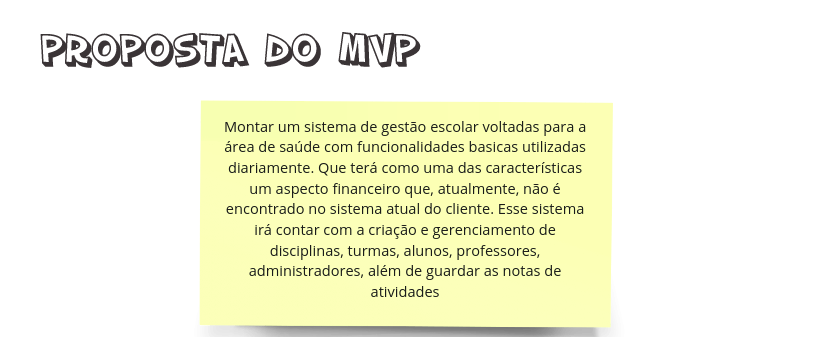
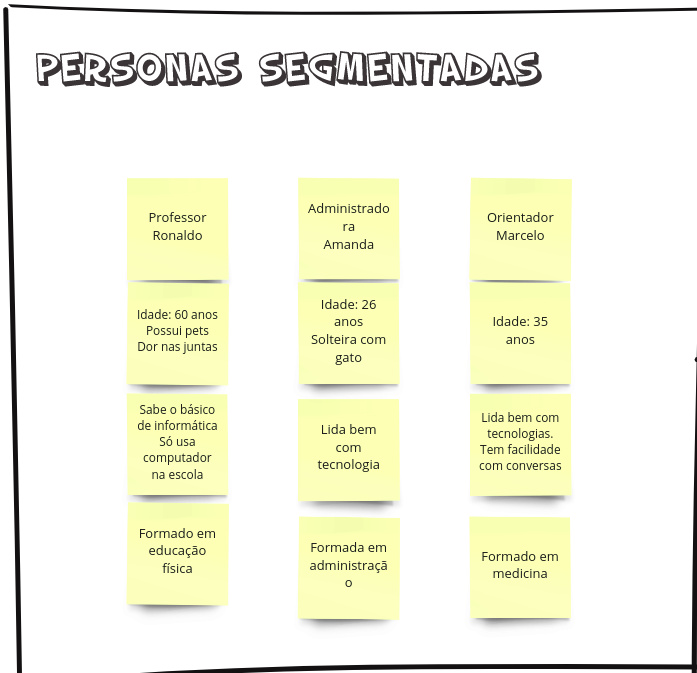
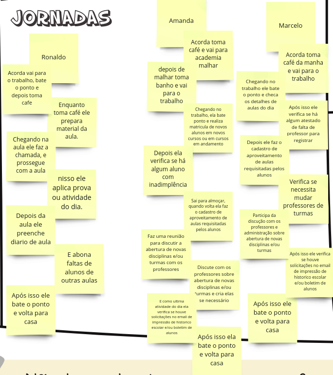
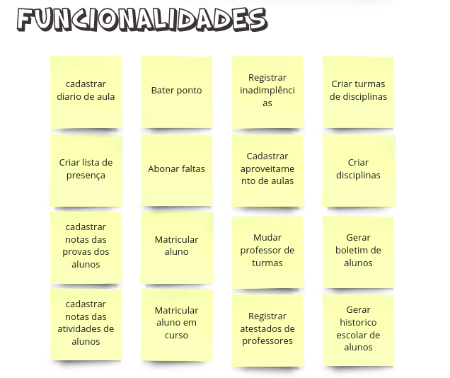
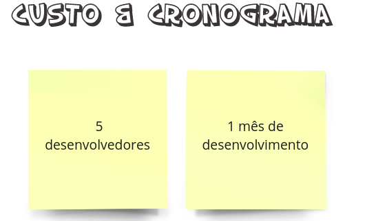
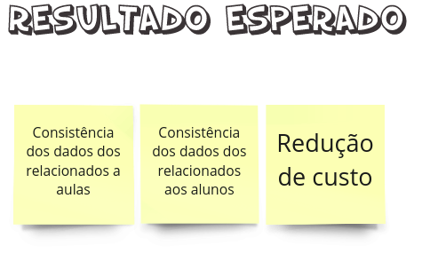
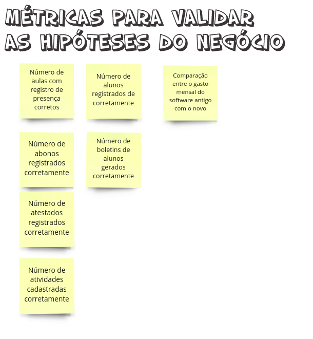
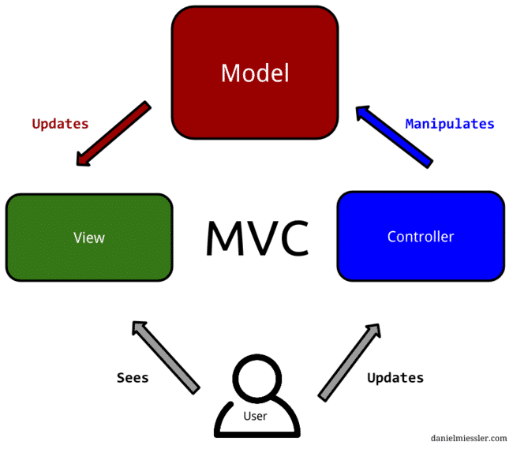
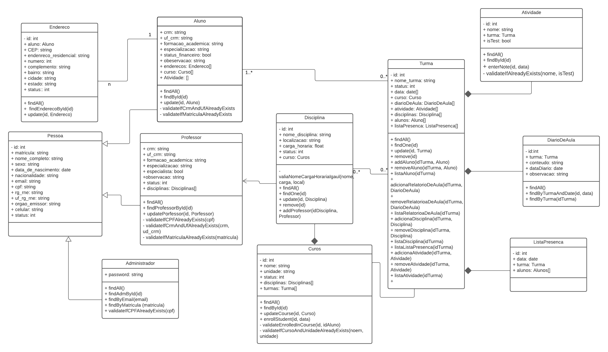

    <h3>Galdi</h3>
 <h2>VISÃO DO PRODUTO E PROJETO</h2>

 
Versão 0.6

## Histórico de Revisão

|Data| Versão | Descrição | Autor|
|----|----|----|----|
|27/06/2022 | 0.1 | Criação do documento | [Ciro Costa](https://github.com/ciro-c)|
|29/06/2022 | 0.2 | Atualização do documento | [Ciro Costa](https://github.com/ciro-c)|
|29/06/2022 | 0.3 | Atualização dos documentos | [Giulia Alcantara](https://github.com/alcantaragiubs)|
|29/06/2022 | 0.4 | Atualização das tecnologias | [Guilherme França](https://github.com/GuiDib)|
|30/06/2022 | 0.5 | Adicionada abordagem de software | [Bruna Lima](https://github.com/libruna)|
|30/06/2022 | 0.6 | Atualização das atividades | [Samuel Sato](https://github.com/samuel-sato)|
|04/06/2022 | 0.7 | Atualização das atividades | [Samuel Sato](https://github.com/samuel-sato)|
|05/06/2022 | 0.8 | Atualização das atividades e participantes | [Ciro Costa](https://github.com/ciro-c)|
|11/06/2022 | 0.9 | Atualização do planejamento | [Ciro Costa](https://github.com/ciro-c)|
|08/07/2022 | 1.0 | Atualização Processo de engenharia de requisitos  | [Nicolas Roberto](https://github.com/Nicolas-Roberto/)|
|13/07/2022 | 1.1 | Atualização da matriz de comunicação  | [Ciro Costa](https://github.com/ciro-c) |]
|14/07/2022 | 1.2 | Atualização de processos e procedimento e adição de lições aprendidas  | [Samuel Sato](https://github.com/samuel-sato) |
|17/07/2022 | 1.3 | Atualização de processos e procedimento  | [Samuel Sato](https://github.com/samuel-sato) |
|19/07/2022 | 1.4 | Atualização de Sprints e gerenciamento de riscos  | [Laura Pinos](https://github.com/laurapinos) |
|19/07/2022 | 1.5 | Retirada dos requisitos do documento e Atualização das lições aprendidas  | [Ciro Costa](https://github.com/ciro-c) |
|27/07/2022 | 1.6 | Atualização dos processos e procedimentos | [Bruna Lima](https://github.com/libruna) |
|27/07/2022 | 1.7 | Atualização de tabelas de requisitos  | [Laura Pinos](https://github.com/laurapinos) |
|02/08/2022 | 1.8 | Detalhamento dos processos da abordagem de software  | [Giulia Alcantara](https://github.com/alcantaragiubs) |
|03/08/2022 | 1.9 | Atualização dos processos e procedimentos | [Bruna Lima](https://github.com/libruna) |
|04/08/2022 | 2.0 | Ajustes no Planejamento das Fases do Projeto | [Bruna Lima](https://github.com/libruna) |
|06/09/2022 | 2.1 | Atualização Planejamento das Fases e/ou Iterações do Projeto   | [Nicolas Roberto](https://github.com/Nicolas-Roberto/)|

## Sumário

 - [VISÃO GERAL DO PRODUTO](#visão-geral-do-produto)
    - 1.1 Declaração de Posição do Produto 
    - 1.2 Objetivos do Produto 
    - 1.3 Tecnologias a Serem Utilizadas 
 - [VISÃO GERAL DO PROJETO](#visão-geral-do-projeto)
    - 2.1 Organização do Projeto 
    - 2.2 Planejamento das Fases e/ou Iterações do Projeto 
    - 2.3 Matriz de Comunicação 
    - 2.4 Gerenciamento de Riscos 
    - 2.5 Critérios de Replanejamento 
    - 2.6 MVP canvas
 - [ABORDAGEM DE DESENVOLVIMENTO DE SOFTWARE](#abordagem-de-desenvolvimento-de-software)
    - 3.1 Metodologia
    - 3.2 Processo e procedimentos
 - [PROCESSO DE ENGENHARIA DE REQUISITOS](#processo-de-engenharia-de-requisitos) 
    - 4.1 Elicitação de Requisitos 
    - 4.2 Análise de Requisitos 
    - 4.3 Documentação de Requisitos 
    - 4.4 Verificação e Validação de Requisitos 
    - 4.5 Gerenciamento de Requisitos 
 - [LIÇÕES APRENDIDAS](#lições-aprendidas)
 - [REFERÊNCIAS BIBLIOGRÁFICAS](#referências-bibliográficas) 

## VISÃO GERAL DO PRODUTO 

### 1.1 Declaração de Posição do Produto 

 <!-- O Galdi (Gestão de Alunos e Didáticos) é um produto que visa gestão de clientes e alunos. A diferença entre o Galdi e outros softwares de gestão como o Pipefy é que o Galdi é focado em négocios voltados para o setor de educação. Tendo como cliente principal instituições de ensino particulares. O principal atrativo do Galdi é a pouca necessidade de customização em relação a outros CRM. -->
  O Galdi (Gestão de Alunos e Didáticos) é um produto que visa gestão de alunos envolvidos na área da saúde. A diferença entre o Galdi e outros softwares de gestão como o da [datalogica](http://datalogica.net/site2/) é que o Galdi é focado em négocios voltados para o setor de educação da área da sáude. Tendo como cliente principal instituições de ensino particulares. O principal atrativo do Galdi é a pouca necessidade de customização em relação a outros softwares de gestão, que, normalmente, não apresentam esse foco nessa área.Além de ter custo baixo de aquisição.

   | | |
   |--|--|
   |Para| Pessoas que mexem com sistemas de gerencia|
   |Quem| Deseja agilidade com processos envolvendo a área da saúde |
   |O Galdi|é um sistema de gestão de alunos na área da saúde|
   |Que| tem custo baixo de aquisição |
   |Ao contrário do |[datalogica](http://datalogica.net/site2/), [SIGAA](https://sig.unb.br/sipac/)|
   | Nosso produto |será intuitivo e dedicado para a área|

### 1.2 Objetivos do Produto 

 <!-- O principal objetivo do Galdi é facilitar a gestão de clientes com a gerência de alunos da instituição centralizando os esforços. -->

 O principal objetivo do Galdi é facilitar a gestão de alunos, da área da saúde, da instituição reduzindo os esforços de gestão e aumentar a fidelidade dos dados.
### 1.3 Tecnologias a Serem Utilizadas 

   - [TypeScript](https://www.typescriptlang.org/)
   - [NestJS](https://nestjs.com/)
   - [NextJS](https://nextjs.org/)
   - [MySQL](https://www.mysql.com/)
   - [Figma](https://www.figma.com/)
   - [Miro](https://www.miro.com/)

## VISÃO GERAL DO PROJETO 
### 2.1 Organização do Projeto 

|Papel|Atribuições| Responsavel |Participantes|
|--|--|--|--|
|Desenvolvedor|Codificar o produto,testes e realizar refatoração| Samuel | Bruna, Giulia, Guilherme|
|Analista de Qualidade|Garantir a qualidade das entregas e se cumprem a ideia proposta| Ciro | Laura, Nicolas|
|Dono do Produto | Atualizar o escopo e validar entregas| Laura | Nicolas, Ciro |
|Mestre do Scrum | Delegar tarefas, duração sprint e sprint review | Nicolas | Ciro, Laura|
|Cliente| Relatar para a equipe as funcionalidades do software e validar as entregas feitas | Gustavo Ian | Ciro,Laura, Nicolas |

### 2.2 Planejamento das Fases e/ou Iterações do Projeto 

|Sprint|Entrega|Início|Fim|
|--|--|--|--|
|1|Deocumento de Visão do Produto e Projeto|20/06/2022|30/06/2022|
|2|Registros de requisitos e estudo de tecnologias|05/07/2022|19/07/2022|
|3|Primeira versão da definição do Backlog do Produto, documento de arquitetura, protótipo de interface e preparação do ambiente de desenvolvimento|19/07/2022|02/08/2022|
|4|Implementação do MVP1, interface de usuário e validação de requisitos|02/08/2022|16/08/2022|
|5|Implementação do MVP1 |16/08/2022|30/08/2022|
|6|Finalização do MVP1, testes e entrega, Implementação do MVP2, testes, interface de usuário, validação de requisitos e entrega|30/08/2022|13/09/2022|

### 2.3 Matriz de Comunicação 

A comunicação se dara principalmente por meio da plataforma WhatsApp.
Reuniões serão feitas no Discord, ou Google meets.

|Descrição|Envolvidos|Periodicidade|Produtos Gerados
|--|--|--|--|
|Sprint Review| Equipe Projeto e Cliente | Semanalmente | Relatório Sprint Review|
|Sprint Planning| Equipe Projeto e Cliente | No mesmo dia da Sprint Review | Relatório Sprint Planning|
|Daily | Equipe Projeto | Diariamente | Atualização sobre andamento do projeto |
|Comunicar situação do projeto| Equipe Projeto e Professor| Aproximadamente 21 dias | Apresentação|

### 2.4 Gerenciamento de Riscos 

   
A análise e gestão de risco auxiliam a equipe a entender problemas e avaliar possíveis riscos encontrados ao desenvolver do projeto, assim, guiando o usuário e desenvolvedor a contenção dos prejuízos. 

   
   Segundo Charette, existem três tipos de riscos de Software (PRESSMAN,2006):
   
   Riscos de projeto mostram problemas potenciais de orçamento, cronograma, organizacionais que impactam o projeto. (PRESSMAN,2006)
   
   Riscos técnicos pertuba a qualidade e a entrega do software. Também mostram problemas potenciais de projeto, implementação, interface, verificação e manutenção. (PRESSMAN,2006)
   
   Riscos de negócio ameaçam a viabilidadea do software e o produto. Existem cinco principais riscos de negócios que são:  (1) criar um excelente produto ou sistema que ninguém realmente quer (risco de mercado), (2) criar um produto que não se encaixe mais na estratégia geral de negócios da empresa (risco estratégico), (3) criar um produto que a equipe de vendas não sabe como vender (risco de vendas), (4) perda de suporte da alta gerência devido à mudança no foco ou mudança de profissionais (risco gerencial), e (5)perda do orçamento ou do comprometimento dos profissionais (riscos de orçamento). (PRESSMAN,2006)
   
   

Figura 1, Tabela de Previsão de Riscos (PRESSMAN,2006)

   Os riscos seram  revistos ao final de cada Sprint e atualizados após a analise da equipe.
     
### 2.5 Critérios de Replanejamento

 - Alteração significativa nas regras de negocio do produto ou de escopo.
 - Desistência de um membro da equipe do projeto.
 - 2 sprints seguidas com tarefas atrasadas, indicação de processos errados.
 - 3 sprints com requisitos repetidos, indicação de requisitos errados.

### 2.6 MVP canvas

  - [Miro mvp](https://miro.com/app/board/uXjVOlmuidc=/?share_link_id=155231888640)

#### 2.6.1 Proposta

#### 2.6.2 Personas

#### 2.6.3 Jornadas

#### 2.6.4 Funcionalidades

#### 2.6.5 Custos

#### 2.6.6 Resultados

#### 2.6.7 Métricas

## ABORDAGEM DE DESENVOLVIMENTO DE SOFTWARE 
### 3.1 Metodologia

Baseado na proposta do Sommerville (2018), foi respondido um conjunto de questões de naturezas distintas para definir a abordagem que melhor se encaixasse ao projeto e time.

- Questões técnicas:

   - <b>Qual é o tamanho do sistema que está sendo desenvolvido?</b> É um software de médio porte. 
   
   - <b>Que tipo de sistema está sendo desenvolvido?</b> Aplicação Web. 
   
   - <b>O sistema está sujeito a controle externo?</b> Sim, o sistema será consumido pela instituição de ensino.

- Questões humanas:

   - <b>Qual é o nível de competência dos projetistas e programadores do time de desenvolvimento?</b> Os integrantes possuem nível básico-intermediário. 
   
   - <b>Como está organizado o time de desenvolvimento?</b> Os desenvolvedores estão dividos entre o front-end e o back-end da aplicação. 
   
   - <b>Quais são as tecnologias disponíveis para apoiar o desenvolvimento do sistema?</b> A princípio o Github para versionamento e Trello para gerenciar o fluxo de atividades.

- Questões organizacionais:

   - <b>É importante ter uma especificação e um projeto (design) bem detalhados antes de passar para a implementação - talvez por motivos contratuais?</b> Como será utilizada uma metodologia de design orientado a função, não tem necessidade de ser bem definido antes da implementação.
   
   - <b>É realista uma estratégia de entrega incremental, na qual o software é entregue aos clientes ou outros stakeholders e um rápido feedback é obtido?</b> Por conta da proximidade do Product Owner(PO) com o cliente e a equipe de desenvolvimento, é realista. 
   
   - <b>Os representantes do cliente estarão disponíveis e dispostos a participar do time de desenvolvimento?</b> Sim, uma vez que o representante faz parte da equipe.
   
   - <b>Existem questões culturais que possam afetar o desenvolvimento do sistema?</b> Não. 

Considerando os resultados obtidos e as necessidades da equipe de priorizar a flexibilidade e o desenvolvimento iterativo, a metodologia ágil foi escolhida. Assim, a abordagem SCRUM foi adotada como ciclo de vida e processo de desenvolvimento baseado no XP (Extreme programming) pelos seguintes motivos: 

- O feedback contínuo do cliente e os requisitos que são construídos junto com o software permitem que qualquer mudança necessária seja feita sem prejudicar o desenvolvimento da aplicação.

- Realização controle das atividades da sprint de forma eficiente

### 3.2 Processo e procedimentos

De acordo com a abordagem SCRUM, foram definidos os seguintes processos:

- *Sprint:* com duração de 2 semanas;
- *Dailys:* momento do dia onde serão apontadas correções e verificações diárias com todo o time;
-  *Backlog do Produto e da Sprint:* são definidos antes de cada Planning;
- *Planning:* realizada no primeiro dia de cada sprint, com atividades como: definir arquiteura, identificação e definição de requisitos, definição de prioridades;
- *Implementação:* codificação, envolve atividades como: modelagem de banco de dados, programação back-ende front-end, criação de cenários de testes e documentação dos requisitos);
- *Review:* ao final de cada ciclo para validar e verificar os requisitos com o Product Owner e reunião com o cliente.
- *Retrospectiva:* também ao final de cada ciclo, momento em que o time reflete sobre como foi o desenvolvimento e pontos de melhoria. Além de realizar a padronização e o armazenamento dos requisitos.
- *Entrega:* realizada de acordo com o que foi definido nos documentos de DOR e DOD.

| Disciplina |Atividade| Processo | Método | Ferramenta | Responsável | Entrega |
|----|----|----|----|----|----|----|
|Requisitos| Definição de user story | Planning | User story | Trello | Laura | Lista de atividades |
|Analise/Design| Definir a arquitetura* | Implementação | MVC| Figma, Miro | Giulia, Guilherme | Processo de elaboração |
|Analise/Design| Prototipação de Baixa Fidelidade* | Implementação | Metáforas e Modelos Conceituais | Figma, Miro | Giulia, Guilherme | Protótipo de página |
|Construção| Modelagem do Banco de Dados | Implementação | Modelo Relacional | DrawIo | Bruna, Samuel | Diagrama UML |
|Construção| Implementação da regra de negócio | Implementação | Programação back-end | NestJs | Bruna, Samuel | Funcionalidades server-side |
|Construção| Interface gráfica do usuário | Implementação | Programação front-end  | NextJs | Giulia, Guilherme | Interface do usuário |
|Teste| Criar cenários de teste para validar os critérios de aceitação e corrigir possíveis falhas | Implementação | Testes unitários | Jest | Bruna, Samuel | Validar se os requisitos foram implementados corretamente |

<h6> Obs.: Atividades com (*) serão realizadas apenas uma vez, ou seja, não se repetirão por mais de um ciclo.</h6>

### 3.3 Arquitetura do projeto
### 3.3.1 MVC

Com base nas caracteristicas dos frameworks utilizados e especificação da aplicação, a arquitetura MVC (Model, View, Controller) será usada para o projeto. MVC é um padrão de arquitetura que divide logicamente o programa em 3 partes:

    - Model: Responsável pelo mapeamento do banco de dados e aplicar regras de negócio
    - View: Camada de apresentação das paginas aos usuários.
    - Controller: Responsável por interligar Model e View, por meio de requisições e respostas.

### 3.3.2 Funcionamento
Todas as resquisições feitas pelo usuário são processadas pelo controller, manipuladas pelo model e são vistas pela view.

### 3.3.3 Diagrama de Classes

### 3.4 Estratégia de Testes
Tipo de Teste:

- Funcional: Avalia se a aplicação faz, de fato, o que ela é
pensada para executar

Nível de Teste:

- Aceitação: Simula a experiência do usuário

Técnica de Teste:

- Manual: Não envolva ferramenta de automação
- Caixa Branca: Teste de condição

### Equipe de desenvolvimento: 

- Caixa branca
- Funcional

### Cliente: 

- Funcional
- Aceitação
- Manual 

### Professor: 

- Funcional 
- Aceitação 
- Manual

## PROCESSO DE ENGENHARIA DE REQUISITOS 

Abordagem escolhida foi a abordagem agil, tendo em vista a necessidade do cliente e do time.

### 4.1 Elicitação de Requisitos 

| Atividade | Método | Ferramenta | Responsável | Entrega |
|----|----|----|----|----|
|Identificação de requisitos | Reunião | Google Meets | integrantes de Requisitos|lista de requisitos |

### 4.2 Análise de Requisitos 

| Atividade | Método | Ferramenta | Responsável | Entrega |
|----|----|----|----|----|
|Definição de requisitos| Brainstorming | Discord ou google meets | integrantes de Requisitos | lista preliminar de requisitos |
|Definição de prioridades| Brainstorming | google meets | integrantes de Requisitos |  lista preliminar de prioridade de requisitos |

### 4.3 Documentação de Requisitos 

| Atividade | Método | Ferramenta | Responsável | Entrega |
|----|----|----|----|----|
|Documentação de requisitos | BackLog do Produto(SAFe) | Github e MIRO | integrantes de Requisitos |  lista de requisitos |

### 4.4 Verificação e Validação de Requisitos 

| Atividade | Método | Ferramenta | Responsável | Entrega |
|----|----|----|----|----|
| Correção | Correção de requisitos | WhatsApp | Nicolas | Requisitos corrigidos |
| Verificação | Revisão de requisitos | WhatsApp | Laura | Requisitos revisados |
| Validação | Inspeção de requisitos | WhatsApp | Laura | Requisitos validados |

### 4.5 Gerenciamento de Requisitos 

| Atividade | Método | Ferramenta | Responsável | Entrega |
|----|----|----|----|----|
|Padronização| Padronizar nome e identificação | Github | integrantes de Requisitos | nome e identificação padronizados |
|Armazenamento| Registrar no github-pages | Github | integrantes de Requisitos | requisitos atualizados no Gitpages |

## LIÇÕES APRENDIDAS

### 5.1 Unidade 1 

### 5.1.1 MDS

  - Disciplinas da Engenharia de Software
  - Metodologias de Desenvolvimento de Software. Em especial, Ágil.
  - Ciclo de vida
  - Rituais do Scrum
  - Práticas do XP

### 5.1.2 Requisitos 

   - Ter comunicação mais clara com os membros
   - Ter uma comunicação mais ativa com o cliente
   - Não gravar os vídeos em cima da hora

### 5.1.3 MDS-Requisitos 

   - Buscar uma comunicação mais ativa entre os grupos
   - Alinhar espectativas
   - Centralizar forma de comunicação entre os times
   - Buscar sanar dúvidas de forma mais rápida

---
### 5.2 Unidade 2 
### 5.2.1 MDS 

   - Boa divisão tarefas e atividades para uma apresentação em conjunto
   - Conhecimento de díversos frameworks linguagens de programação apresentados
   - Conhecimento prático de testes unitários com Jest

### 5.2.2 Requisitos 

   - Buscar de forma mais ativa a resolução de tarefas
 

### 5.2.3 MDS-Requisitos 

   - Resolução de desencontros de tempo e horário
   - Distribuição de responsabilidades
---
 ### 5.3 Unidade 3 
 ### 5.3.1 MDS 
   - Conhecimentos sobre boas práticas de programação
   - Arquitetura de MVC
   - Construção de protótipo de baixa fidelidade
   - Boas práticas de trabalho em grupo: Soft Skills
 ### 5.3.2 Requisitos 
 ### 5.3.3 MDS-Requisitos 
   - Resolução de conflitos de equipe
---
 ### 5.4 Unidade 4 
 ### 5.4.1 MDS 
   - Estratégias para resolução de Testes
 ### 5.4.2 Requisitos 
 ### 5.4.3 MDS-Requisitos
   - Resolução de conflitos de equipe

---
## REFERÊNCIAS BIBLIOGRÁFICAS 
PRESSMAN, R S. Engenharia de Software. 6.ed. São Paulo: Mc Graw Hill Internacional, 2006
